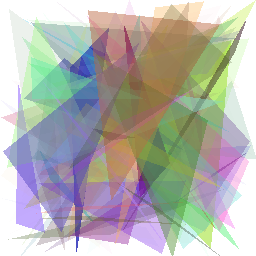

# Play_NSFW
This repo contains a few works I played around with 
 [Open NSFW](https://yahooeng.tumblr.com/post/151148689421/open-sourcing-a-deep-learning-solution-for) from Yahoo, an open source deep learning solution for detecting NSFW( not suitable/safe for work ) images. There are many reasons for an image to be considered as NSFW, but currently open nsfw only considered images with sexual conents.

Most of the stuff requires  theano, lasagne, numpy, PIL and Jupyter notebook.
These works include:
*   theano/lasagne port of Open NSFW
*  Using genetic/evolutionary alogrithm to generate images with high NSFW score
*  Inverse open NSFW: Modified an image to have an arbitrary NSFW score (e.g. 0 to 1 or 0 to 1), but the modification is visually undetectable.

## theano/lasagne port of Open NSFW
[open_nsfw.py](open_nsfw.py) is the main module contains the code of constructing open nsfw network. It parse the deploy.prototxt file from original open nsfw project and construct the corresponding lasagne network layers.
The pretrained weight is stored in nsfw.pkl, which is converted from the caffemodel from original open nsfw project. 
For end users, the simplest way to use it is `from open_nsfw import nsfw_score` and then `nsfw_score(img)`, where img can be the file name of the image or an PIL Image object.  It will return the nsfw_score as a float number between 0 and 1.  An image with socre higher than 0.8 can be cosidered as NSFW. An image with score less than 0.2 can be considered as SFW. 

`nsfw.pkl` and `nsfw_model/deploy.prototxt` needs to be placed in the current working directory. If not, the path of theses files can be passed to `nsfw_score` using keyword arguments `nsfw_pkl_path` and `deploy_prototxt_path`. For example:
```python
nsfw_score(img, 
		nsfw_pkl_path="/home/u/nsfw.pkl", 
		deploy_prototxt_path="/opt/deploy.prototxt")
```
The result of this port is slightly different than the original one (~0.005). One root of the difference is from batch norm layer.  The result of `bn_1` is different up to 1e-7. I might misunderstood the meanings of the blobs of caffe batchnorm layers( I use `mean =blobs[0]/blobs[2]`, `variance=blobs[1]/blobs[2]`, and `epsilon=1e-5`). 
The work is done in jupyter notebook and the `.py` file is converted from [open_nsfw.ipynb](open_nsfw.ipynb). See the notebook for results of example images. 

##  Using genetic/evolutionary alogrithm to generate images with high NSFW score

This part requires [DEAP](https://github.com/DEAP/deap). It use simple and naive evolutionary algorithm to generate images consists with circles or triangles.
The naive and simple algorithm is not particularly efficient, but is interesting to watch it work. When the target is a picture, it can generate recognizable results with some kind of artistic style.
This experiment use the same algorithm but the target function is replaced by NSFW score. We can imagine two possible results: one is probably some kind of sexual related content with artistic style. The other might just some abstract image with high NSFW score (and in artistic style).

It is the later case.


[NSFW-Triangles.ipynb](NSFW-Triangles.ipynb): this is the result for 100 triangles.

 

NSFW score: `0.989984035492` 

[NSFW-Circles.ipynb](NSFW-Circles.ipynb): this is the result for 50 circles.

 

NSFW score: `0.999073386192`

Both images have some what significant portion with skin like colors. This might or might not mean something. Other than this, I haven't see any pattern.

##  Inverse open NSFW

Lasagne and other python packages like scipy provides many efficient optimization method can help us to find an image with certain NSFW score.
We use adam provided by lasagne. Turns out it can find an input data with near to 1 or near to 0 score very quickly. 

Say we start from an NSFW image and run the optimization to get a very low NSFW score.  We are practically trying to find a neighbor of this image having low score. We can imagine two possible scenario. 
* The image is visually unchanged
* Certain part being censored.
It seems that there are images with high scores and images with low scores in every small neighborhood. Since the neighborhood is so small, the change is unnoticeable ny naked eyes. 

However, the problem is, the original Open NSFW uses a preprocess to prepare the input image. It first resize the image to 256x256. And then comressed using JPEG enocing. Then Decompress it then feed to the network.

After applying this procedure, the score of an image can be dramastically change. In order to apply adam or other differential based method to the original image, we need to reformulate the jpeg encoding, decoding process in a differentiable way.  This might take awhile and might not be even practical or possible.

Instead, we construct a covolutional neural network attempt to learn the result image of the jpeg encoding. 
To learn the behaviour of jpeg encoding may need a large network and a lot of time. But we only need the mock jpeg encoder works for certain input and our input are hopefully very similar(in a small neighborhood like mentioned above), so this might just work.

This mock jpeg encoder imporves the result but is not accurate enough. Therefore, we modified the loss function of the mock jpeg encoder, to make it act like an adversary of the inverse nsfw model. By doing so, hopefully the inaccuracy would not help the inverse nfsw model. 

The code is in [Inverse-NSFW.ipynb](Inverse-NSFW.ipynb)
Followings are some results: 
<table>
<tbody>
<tr>
<th>Original</th><th>Inversed</th></tr>
<tr>
<td>   

NSFW score: `0.0018048202619`
</td>
<td>   

NSFW score: `0.983393967152`  
(8000 iterations)
</td>
</tr>
<tr>
<td>
 

NSFW score: `0.00257238722406`
</td>
<td>
  

NSFW score: `0.983393967152`
(8000 iterations)
</td>
</tr>
<tr>
<td>
  

NSFW score: `0.952058911324`
</td>
<td>
 

NSFW score: `0.0292308945209` 
(2000 iterations)
</td>
</tr>
<tr>
<td>
  

NSFW score: `0.951349616051`
</td>
<td>
  

NSFW score: `0.0644422993064`
(1000 iterations)
</td>
</tr>
</tbody>
</table>